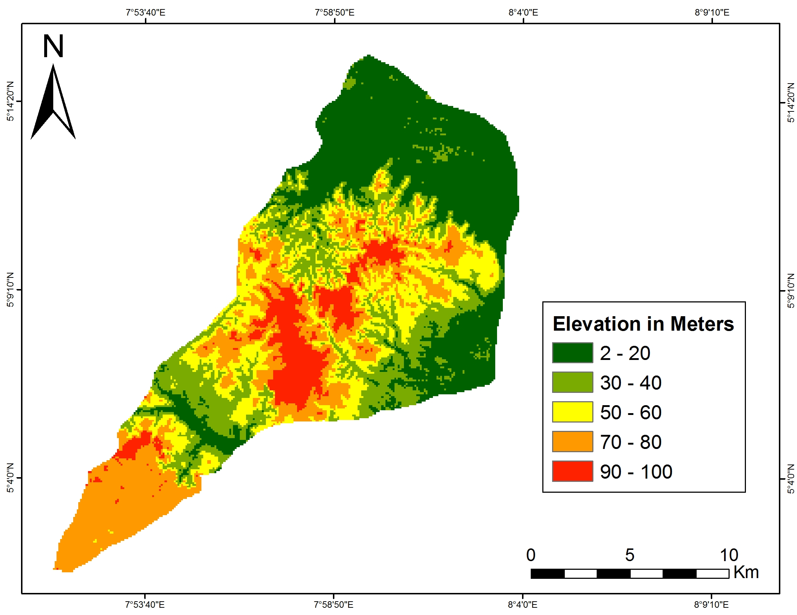
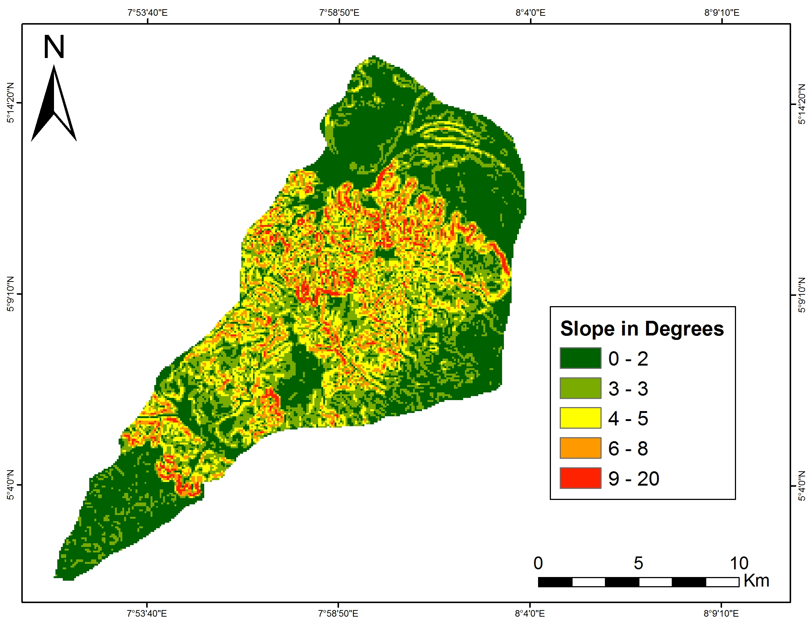
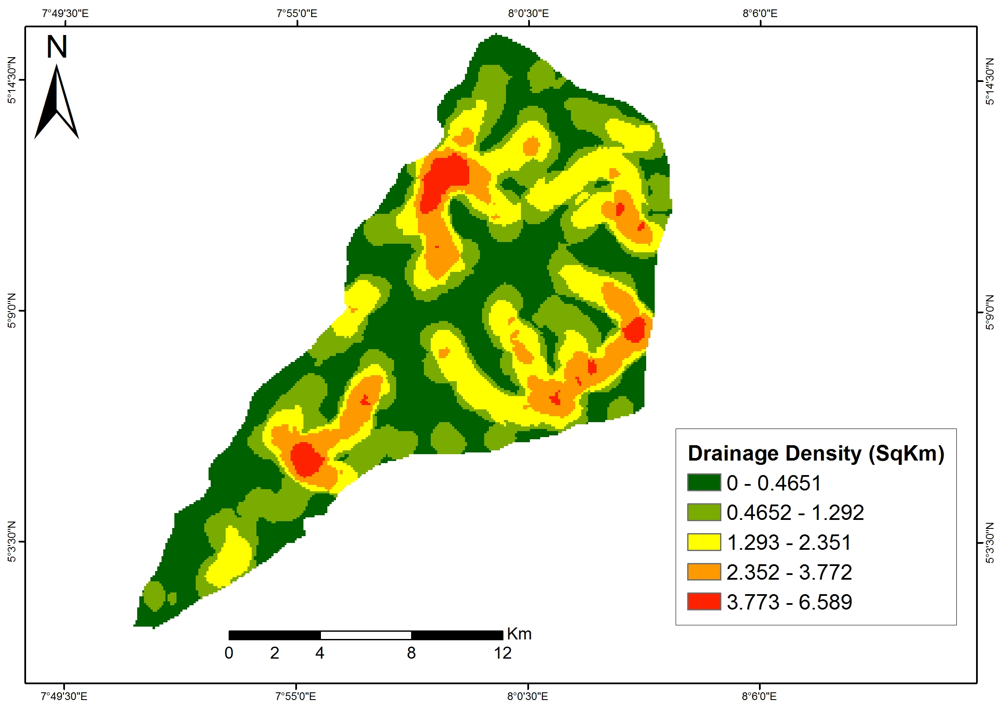
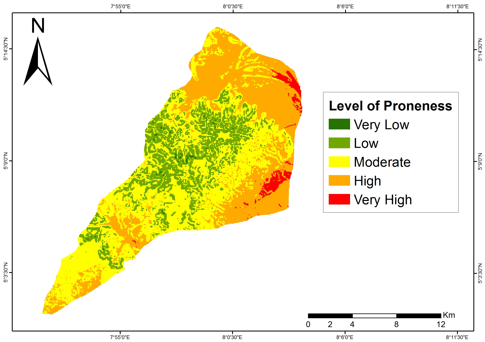

# Assessment of Flood-Prone Areas and Mitigation Strategies in Itu L.G.A Using GIS
### GIS-Based Flood Risk Mapping — Akwa Ibom State, Nigeria

**Type:** Undergraduate Research Project (B.Sc. Geography and Natural Resources Management)
**Institution:** University of Uyo
**Author:** Kenneth Shaho Sunday
**Year:** 2022

---

## Project Overview

This project maps flood-prone zones in Itu Local Government Area, Akwa Ibom State. It combines GIS with the Analytic Hierarchy Process (AHP). The goal is to identify areas at risk and support flood mitigation planning.

Itu LGA covers about 606 km². It sits in a tropical zone with rainfall year-round. This makes flood risk assessment important for local planning.

## Objectives

- Map flood-prone areas in Itu using remote sensing and GIS
- Determine the vulnerability level of each flood-prone zone
- Give planners a low-cost method to identify at-risk areas
- Recommend mitigation and adaptation strategies

## Data Sources

| Data | Type | Source |
|---|---|---|
| Landsat 8 OLI | Multi-spectral satellite imagery | USGS |
| SRTM | Digital Elevation Model (DEM) | CGIAR-CSI |
| Rainfall | Gridded precipitation data (2020) | CRU TS |
| Soil | Digital World Soil Map | FAO |
| Questionnaire | Primary survey data (400 respondents) | Field survey |

## Methodology

1. **Data Acquisition** — Collected DEM, satellite imagery, rainfall, and soil data
2. **Factor Mapping** — Derived six flood-causing factors: slope, elevation, rainfall, land use/land cover, drainage density, and soil type
3. **Reclassification** — Ranked each factor layer into five classes, from very low to very high flood influence
4. **Weighting (AHP)** — Applied the Analytic Hierarchy Process to assign relative importance weights to each factor
5. **Weighted Overlay** — Combined all weighted layers in GIS to produce a final flood-prone map
6. **Field Validation** — Administered 400 questionnaires to residents to assess flood experience and perception
7. **Statistical Testing** — Used Spearman correlation to test relationships between flood factors, experience, vulnerability, and mitigation





## Tools & Software

- **ArcMap 10.3** — geoprocessing, reclassification, weighted overlay
- **Spatial Analyst Tools** — slope, drainage density derivation
- **SAS.Planet** — high-resolution imagery for accuracy assessment
- **SPSS** — statistical analysis of survey data

## Key Findings



Factor weights from the AHP process, in order of influence on flood risk:

| Rank | Factor | Weight (%) |
|---|---|---|
| 1 | Slope | 34 |
| 2 | Elevation | 26 |
| 3 | Rainfall | 19 |
| 4 | Land Use/Land Cover | 11 |
| 5 | Drainage Density | 6 |
| 6 | Soil Type | 4 |

Flood-prone zone distribution across the study area:

| Flood Risk Level | Area (km²) | % of Study Area |
|---|---|---|
| Very High | 51.45 | 2.04 |
| High | 923.79 | 36.62 |
| Moderate | 1,119.79 | 44.39 |
| Low | 421.34 | 16.70 |
| Very Low | 6.16 | 0.24 |

High and very high risk zones cover about 38.66% of Itu LGA. These zones sit mainly in the eastern and northeastern parts of the study area. They are marked by low slope, low elevation, high drainage density, and poorly permeable soil.

Low-risk zones sit mainly in the western and southwestern parts. They have steeper slopes, higher elevation, and more permeable soil.

Statistical tests confirmed two relationships. First, flood factors correlate positively with flood experience. Second, flood vulnerability correlates positively with the need for mitigation strategies. Both results were significant at the 0.01 level.

## Conclusion

GIS and AHP proved effective for mapping and quantifying flood risk in Itu LGA. The method is low-cost and repeatable. It gives planners a practical tool for identifying at-risk zones ahead of development decisions.

## Recommendations

- Apply targeted mitigation strategies in high-risk zones
- Enforce land-use planning controls in flood-prone areas
- Extend similar flood-risk studies to neighboring LGAs

## Skills Demonstrated

- Multi-criteria decision analysis (AHP)
- Raster reclassification and weighted overlay in GIS
- DEM-derived terrain analysis (slope, drainage density)
- Land use/land cover classification from satellite imagery
- Survey design and statistical hypothesis testing
- Flood risk mapping and cartographic communication

## Repository Structure

```
itu-flood-prone-gis/
├── README.md                  # This document
├── maps/
│   ├── flood-prone-map.png
│   ├── slope-layer.png
│   ├── elevation-layer.png
│   └── drainage-density-map.png
```

## Attribution

- Satellite imagery: U.S. Geological Survey (USGS)
- DEM: CGIAR Consortium for Spatial Information (CGIAR-CSI)
- Rainfall data: Climatic Research Unit Time-Series (CRU TS)
- Soil data: Food and Agriculture Organization (FAO)

---

### Author
**Kenneth**
GIS Analyst | Monitoring & Evaluation | Geospatial Data Visualization
📍 Abuja, Nigeria
